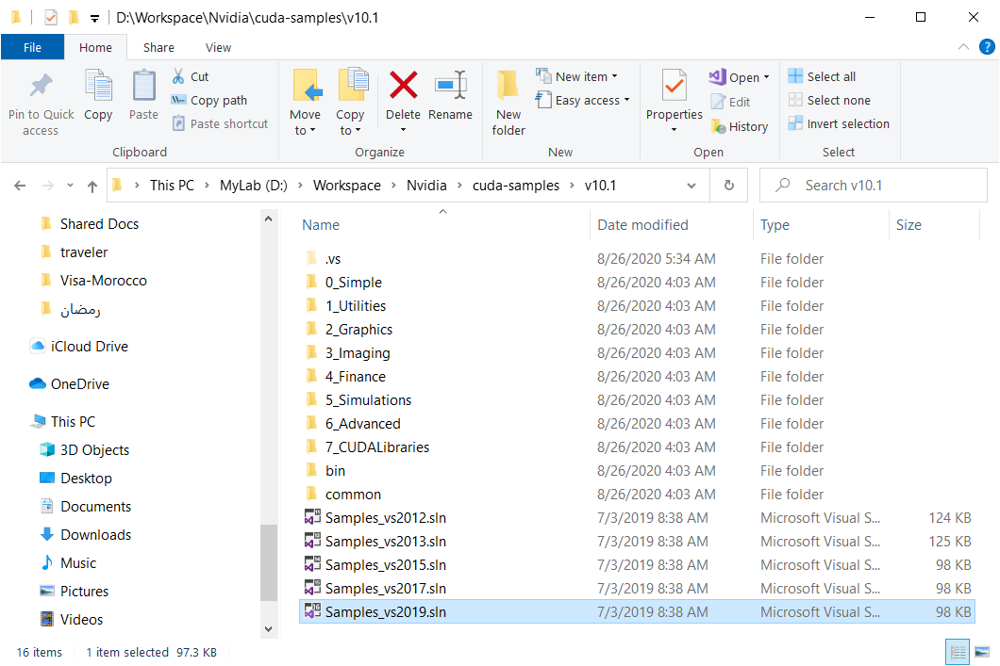

# Windows-CarND-Term1-Starter-Kit
This repository is to guide you how to create the development environment of Udacity Self-driving cars Nanodegree on Windows 10 with GPU Support.

## 1. Objective

The objective of this tutorial is to setup a development environment on this envimachine to execute the labs of the [Udacity Self-Driving Car Engineer Nanodegree](https://classroom.udacity.com/nanodegrees/nd013/dashboard/overview). The main objective is to utilize my laptop's GPU. 

The steps of installing the environment is guided with [the requirements to install TensorFlow][1] on this my machine.

## 2. My Environment
I have a Laptop that I am using for the development activities and labs with the following specifications.
1. Lenovo ThinkPad P52 with:
    1.  32G RAM
    2.  500G SSD HD
    3. Intel(R) Core(TM) i7-8850H CPU @ 2.60GHz, 2592 Mhz, 6 Core(s), 12 Logical Processor(s)
    4.  NVIDIA Corporation [GP107 [Quadro P1000]][2] GPU with compute compatibility 6.1
2. Windows 10 64 bit
    1. Version: 10.0.18363 Build 18363

When I run the command `nvidia-smi` in the powershell I got the following outcome which indicates that my crrent nvidia driver version is 432.13.

```
+-----------------------------------------------------------------------------+
| NVIDIA-SMI 432.13       Driver Version: 432.13       CUDA Version: 10.1     |
|-------------------------------+----------------------+----------------------+
| GPU  Name            TCC/WDDM | Bus-Id        Disp.A | Volatile Uncorr. ECC |
| Fan  Temp  Perf  Pwr:Usage/Cap|         Memory-Usage | GPU-Util  Compute M. |
|===============================+======================+======================|
|   0  Quadro P1000       WDDM  | 00000000:01:00.0  On |                  N/A |
| N/A   52C    P8    N/A /  N/A |    687MiB /  4096MiB |      0%      Default |
+-------------------------------+----------------------+----------------------+
```

## 3. Setup steps Summary

In general, I am following the steps of [Installing Tensorflow with CUDA, cuDNN and GPU support on Windows 10 article][3]. However as this article is a bit old (April 2019), I am updating it with the lateses updates to reflect the current versions.

The steps as per the initial [TensorFlow installation][1] are installing the following software components:

1. Microsoft [Visual Studio Community 2019 (version 16.7)][6]
2. NVIDIA [CUDA Toolkit 10.1 Update 2 (10.1.243)][4]
3. NVIDIA [cuDNN 7.6.5 for Windows 10][9]
4. Anaconda Python Distribution [Individual Edition][10]
5. Python Environment [(with GPU support)][12]

## 4. Install Microsoft Visual Studio
Microsoft Visual Studio is a prerequisite for the CUDA 10.1 installation as per the [CUDA Toolkit documentation][5]. 

I downloaded the installer and installed the [Visual Studio Community 2019 (version 16.7)][6] and followed the installation guidelines.

## 5. NVIDIA CUDA Toolkit 10.1

I installed the [CUDA Toolkit 10.1 Update 2 (10.1.243)][4]. I followed the same instructions of the installer.

### 5.1 Setup the toolkit

When I started the installation it gives me a warning that the this software will install an older driver (v 426.00) while the existing driver is 432.13 which is newer. 

I selected the custom option of the installation and unselected the driver componenets. I also unselected the Other components / NVWMI as it was already installed on my machine 


Then I selected the paths for the installation (I used to have my personal setup for the paths.)

Finally the result of the installation was as below screen:


### 5.2 Validating the CUDA Toolkit installation

To validate that the CUDA Tookit is properly installed I went through the build of the examples using VisualStudio. I had the following error when I tried to open the VisualStudio 19 solution file available under the examples as the below folder structure

> **NOTE:** 
> Please Note that I selected a custom path for the installation as I used to have my own private structure. I think this introduced a problem when I tried to load the solution file.



When I opened the solution I receved the following error for every project of the 168 projects built.

```
Error HRESULT E_FAIL has been returned from a call to a COM component
```
To fix it, and as I know I may have unusual folder path I followed some of the guidelines [for this question][7] specially the actin for:
> Then resetting the visual studio settings via
> ```
> Tools>Import and export settings>reset all settings
> ```

After that I restarted VisualStudio 2019 and all of a sudden it start loading the projects. I built all the projects and they are all succeeded except 3 projects which needs dependencies that I didn't install and it was not a big deal.

I ran the following commands and applicaitons to validate the installation as per the documentation and it went fine as the following:

Execute the command `nvcc -V` in command prompt.The outcome was: 

```
nvcc: NVIDIA (R) Cuda compiler driver
Copyright (c) 2005-2019 NVIDIA Corporation
Built on Sun_Jul_28_19:12:52_Pacific_Daylight_Time_2019
Cuda compilation tools, release 10.1, V10.1.243
```
Then [run the compiled examples programs][8] and the outcome of it is the following:

Outcome of `deviceQuery` sample:

```
 CUDA Device Query (Runtime API) version (CUDART static linking)

Detected 1 CUDA Capable device(s)

Device 0: "Quadro P1000"
  CUDA Driver Version / Runtime Version          10.1 / 10.1
  CUDA Capability Major/Minor version number:    6.1
  Total amount of global memory:                 4096 MBytes (4294967296 bytes)
  ( 4) Multiprocessors, (128) CUDA Cores/MP:     512 CUDA Cores
  GPU Max Clock rate:                            1519 MHz (1.52 GHz)
  Memory Clock rate:                             3004 Mhz
  Memory Bus Width:                              128-bit
  L2 Cache Size:                                 524288 bytes
  Maximum Texture Dimension Size (x,y,z)         1D=(131072), 2D=(131072, 65536), 3D=(16384, 16384, 16384)
  Maximum Layered 1D Texture Size, (num) layers  1D=(32768), 2048 layers
  Maximum Layered 2D Texture Size, (num) layers  2D=(32768, 32768), 2048 layers
  Total amount of constant memory:               65536 bytes
  Total amount of shared memory per block:       49152 bytes
  Total number of registers available per block: 65536
  Warp size:                                     32
  Maximum number of threads per multiprocessor:  2048
  Maximum number of threads per block:           1024
  Max dimension size of a thread block (x,y,z): (1024, 1024, 64)
  Max dimension size of a grid size    (x,y,z): (2147483647, 65535, 65535)
  Maximum memory pitch:                          2147483647 bytes
  Texture alignment:                             512 bytes
  Concurrent copy and kernel execution:          Yes with 5 copy engine(s)
  Run time limit on kernels:                     Yes
  Integrated GPU sharing Host Memory:            No
  Support host page-locked memory mapping:       Yes
  Alignment requirement for Surfaces:            Yes
  Device has ECC support:                        Disabled
  CUDA Device Driver Mode (TCC or WDDM):         WDDM (Windows Display Driver Model)
  Device supports Unified Addressing (UVA):      Yes
  Device supports Compute Preemption:            Yes
  Supports Cooperative Kernel Launch:            No
  Device PCI Domain ID / Bus ID / location ID:   0 / 1 / 0
  Compute Mode:
     < Default (multiple host threads can use ::cudaSetDevice() with device simultaneously) >

deviceQuery, CUDA Driver = CUDART, CUDA Driver Version = 10.1, CUDA Runtime Version = 10.1, NumDevs = 1
Result = PASS
```

Outcome of `bandwidthTest` program:

```
[CUDA Bandwidth Test] - Starting...
Running on...

 Device 0: Quadro P1000
 Quick Mode

 Host to Device Bandwidth, 1 Device(s)
 PINNED Memory Transfers
   Transfer Size (Bytes)        Bandwidth(GB/s)
   32000000                     12.1

 Device to Host Bandwidth, 1 Device(s)
 PINNED Memory Transfers
   Transfer Size (Bytes)        Bandwidth(GB/s)
   32000000                     11.6

 Device to Device Bandwidth, 1 Device(s)
 PINNED Memory Transfers
   Transfer Size (Bytes)        Bandwidth(GB/s)
   32000000                     77.1

Result = PASS

NOTE: The CUDA Samples are not meant for performance measurements. Results may vary when GPU Boost is enabled.
```
## 6. Install cuDNN 7.6.5

As I installed CUDA Toolkit 10.1 I have to install cuDNN v7.6.5 as shown below:


After downloading it, you will need to extract it to a floder and then you will see the outcome of the following command

```
C:\Users\AHMEDABDEL-FATTAH\Downloads\Development\Nvidia\cuDNN_7_6_5\cuda>ls
NVIDIA_SLA_cuDNN_Support.txt  bin  include  lib
```
Then you will need to move the listed files from the `<download_path>` extracted as follows :

```
<download_path>\bin\cudnn64_7.dll --to be copied to--> %CUDA_PATH%\bin\
<download_path>\include\cudnn.h --to be copied to--> %CUDA_PATH%\include\
<download_path>\lib\x64\cudnn.lib --to be copied to--> %CUDA_PATH%\lib\x64\
```

You can do that by executing the following commands

```
C:\Users\AHMEDABDEL-FATTAH\Downloads\Development\Nvidia\cuDNN_7_6_5\cuda>move bin\cudnn64_7.dll %CUDA_PATH%\bin\
        1 file(s) moved.

C:\Users\AHMEDABDEL-FATTAH\Downloads\Development\Nvidia\cuDNN_7_6_5\cuda>move include\cudnn.h %CUDA_PATH%\include\
        1 file(s) moved.

C:\Users\AHMEDABDEL-FATTAH\Downloads\Development\Nvidia\cuDNN_7_6_5\cuda>move lib\x64\cudnn.lib %CUDA_PATH%\lib\x64\
        1 file(s) moved.

C:\Users\AHMEDABDEL-FATTAH\Downloads\Development\Nvidia\cuDNN_7_6_5\cuda>
```
where in my case %CUDA_PATH% could be verified as follows:

```
C:\>echo %CUDA_PATH%
D:\dev-programs\Nvidia\cuda-toolkit\v10.1
```

when I execute command `echo %PATH%` the outcome includes the following paths:

```
D:\dev-programs\Nvidia\cuda-toolkit\v10.1\bin;D:\dev-programs\Nvidia\cuda-toolkit\v10.1\libnvvp;
```

## 7. Install Anaconda Python Distribution

I used the Anaconda Python Distribution [Individual Edition][10] to be used as my main python distribution and in which I can setup different python environments.

I followed the [installation documentation][11]

## 8. Create the Python Enviroment

In the last step we need to create the development environment which is listed in the [environment-gpu.yml][12] and listed in the code below for the reference:

```
name: carnd-term1
channels:
    - https://conda.anaconda.org/menpo
    - conda-forge
dependencies:
    - python==3.5.2
    - numpy
    - matplotlib
    - jupyter
    - pillow
    - scikit-learn
    - scikit-image
    - scipy
    - h5py
    - eventlet
    - flask-socketio
    - seaborn
    - pandas
    - ffmpeg
    - imageio
    - pyqt=4.11.4
    - pip:
        - moviepy
        - opencv-python
        - requests
        - https://storage.googleapis.com/tensorflow/linux/gpu/tensorflow_gpu-1.3.0-cp35-cp35m-linux_x86_64.whl
        - keras==2.0.9
```

That is the original setup that was listed in the environment yml file. I had severl trials to run the file as per the documentation 

```
conda env create -f environment.yml
```
But this didn't work due to failer in several cases ao I had to start Anaconda Navigator to create the environment and then install the different packages one by one. I followed the same list of the packages in the same order and here is a summary.

### 8.1 Environment `carnd-term1`

In this environment I created a python environment 3.5.6 as the current 3.5 latest version. When I tried to add the package `eventlet` it gave me the following error:

```
UnsatisfiableError: The following specifications were found
to be incompatible with the existing python installation in your environment:

Specifications:

  - eventlet -> python[version='>=3.7,<3.8.0a0']

Your python: python=3.5

If python is on the left-most side of the chain, that's the version you've asked for.
When python appears to the right, that indicates that the thing on the left is somehow
not available for the python version you are constrained to. Note that conda will not
change your python version to a different minor version unless you explicitly specify
that.

The following specifications were found to be incompatible with your CUDA driver:

  - feature:/win-64::__cuda==10.1=0

Your installed CUDA driver is: 10.1
```
Which indicate that the current version of eventlet is no longer support lower versions than 3.7. and also supporting 3.8

So I tried to install the environment on Python 3.8

### 8.2 Environment `carnd-term1-38`

On the first trial to install a set of packages I received the following error.

```
UnsatisfiableError: The following specifications were found
to be incompatible with the existing python installation in your environment:

Specifications:

  - eventlet -> python[version='>=3.7,<3.8.0a0']
  - flask-socketio -> python[version='>=2.7,<2.8.0a0|>=3.6,<3.7.0a0|>=3.7,<3.8.0a0|>=3.5,<3.6.0a0']

Your python: python=3.8

If python is on the left-most side of the chain, that's the version you've asked for.
When python appears to the right, that indicates that the thing on the left is somehow
not available for the python version you are constrained to. Note that conda will not
change your python version to a different minor version unless you explicitly specify
that.

The following specifications were found to be incompatible with each other:

Output in format: Requested package -> Available versions

Package six conflicts for:
pandas -> python-dateutil[version='>=2.7.3'] -> six[version='>=1.5']
eventlet -> pyopenssl -> six[version='>=1.5.2']
eventlet -> six[version='>=1.10.0']
flask-socketio -> python-socketio[version='>=4.3.0'] -> six[version='>=1.9.0']
seaborn -> patsy -> six

Package vc conflicts for:
pandas -> vc[version='14.*|9.*|>=14.1,<15.0a0']
seaborn -> matplotlib[version='>=2.1.2'] -> vc[version='14.*|>=14.1,<15.0a0|9.*']
ffmpeg -> vc[version='9.*|>=14.1,<15.0a0']
flask-socketio -> python -> vc[version='14.*|>=14.1,<15.0a0|9.*']
python=3.8 -> vc[version='>=14.1,<15.0a0']
python=3.8 -> openssl[version='>=1.1.1e,<1.1.2a'] -> vc=9
eventlet -> greenlet[version='>=0.3'] -> vc[version='14.*|>=14.1,<15.0a0|9.*']

Package ca-certificates conflicts for:
pandas -> python[version='>=2.7,<2.8.0a0'] -> ca-certificates
seaborn -> python -> ca-certificates
python=3.8 -> openssl[version='>=1.1.1g,<1.1.2a'] -> ca-certificates
flask-socketio -> python -> ca-certificates

Package pandas conflicts for:
seaborn -> pandas[version='>=0.14.0|>=0.22.0']
seaborn -> statsmodels[version='>=0.5.0'] -> pandas[version='>=0.14|>=0.21']

Package vs2008_runtime conflicts for:
seaborn -> python -> vs2008_runtime
pandas -> python[version='>=2.7,<2.8.0a0'] -> vs2008_runtime[version='>=9.0.30729.1,<10.0a0']
flask-socketio -> python -> vs2008_runtime
ffmpeg -> vc=9 -> vs2008_runtime[version='>=9.0.30729.1,<10.0a0']

Package zlib conflicts for:
seaborn -> matplotlib[version='>=2.1.2'] -> zlib[version='>=1.2.11,<1.3.0a0']
python=3.8 -> sqlite[version='>=3.32.3,<4.0a0'] -> zlib[version='>=1.2.11,<1.3.0a0']The following specifications were found to be incompatible with your CUDA driver:

  - feature:/win-64::__cuda==10.1=0

Your installed CUDA driver is: 10.1

```
Then I added conda-forge channel to the list of channels available by using the command

```
conda config --append channels conda-forge
```

Then I added the packages one by one in the anaconda navigator. 

> **NOTE**: When I try selecting the needed packages listed, I always receive a conflict error which is misleading in most of the time

The following packages was installed using pip instead of installing it using anaconda navigator ` opencv-python, tensorflow, keras `

I used the following commands on the Anaconda Powershell Prompet

```
conda activate carnd-term1-38
pip install opencv-python
pip install tensorflow
pip install keras
```

### 8.3 Validate TensorFlow access to GPU

To validate the setup I wanted to run the [`tensorflow-test-gpu-support` notebook](tensorflow-test-gpu-support.ipynb) using the direction in [this answer][13]

Here is the [export of this notebook](tensorflow-test-gpu-support.md) for your reference

[1]: https://www.tensorflow.org/install/gpu
[2]: https://www.gpuzoo.com/GPU-NVIDIA/Quadro_P1000.html
[3]: https://towardsdatascience.com/installing-tensorflow-with-cuda-cudnn-and-gpu-support-on-windows-10-60693e46e781
[4]: https://developer.nvidia.com/cuda-10.1-download-archive-update2?target_os=Windows&target_arch=x86_64&target_version=10&target_type=exelocal
[5]: https://docs.nvidia.com/cuda/archive/10.1/cuda-installation-guide-microsoft-windows/index.html
[6]: https://my.visualstudio.com/Downloads?q=Visual%20Studio%202019
[7]: https://stackoverflow.com/questions/13361199/error-hresult-e-fail-has-been-returned-from-a-call-to-a-com-component-vs2012-whe
[8]: https://docs.nvidia.com/cuda/cuda-installation-guide-microsoft-windows/index.html#compiling-examples
[9]: https://developer.nvidia.com/rdp/cudnn-archive
[10]: https://www.anaconda.com/products/individual#windows
[11]: https://docs.anaconda.com/anaconda/install/windows/
[12]: https://github.com/udacity/CarND-Term1-Starter-Kit/blob/master/environment-gpu.yml
[13]: https://stackoverflow.com/questions/35254852/how-to-change-the-jupyter-start-up-folder